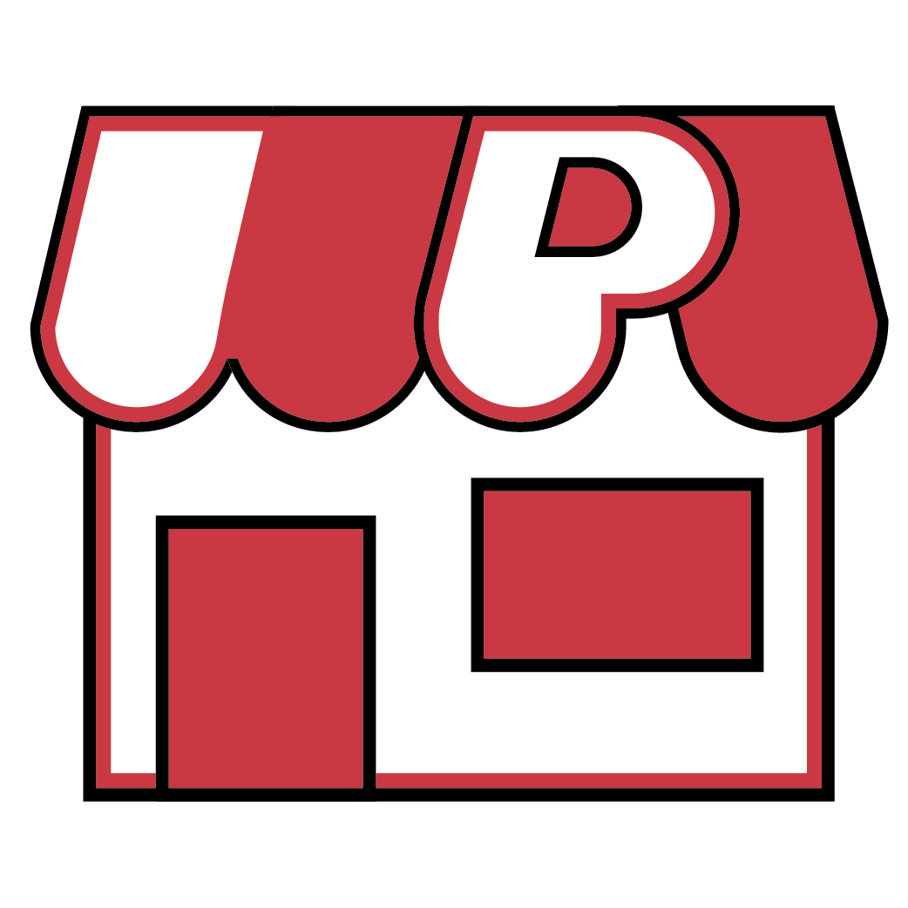
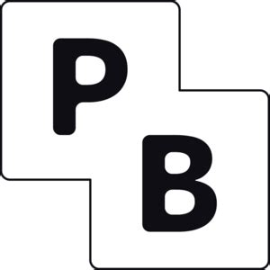

# TechTrade

TechTrade was developed in January 2025 for WPI's annual Goathacks Hackathon. The goal of this project was to create a platform for WPI Students to buy and sell their belongings. Inspired by Facebook Marketplace, the team wanted a place to sell their unwanted WPI related belongings, such as textbooks, toolkits, school supplies and more.

In the future we would want to implement chat functionality so that people can communicate within the platform instead of contacting them through an email. Verify users are WPI students by using their WPI email, instead of just asking for ID.

# Contributors

Jeremy Kurtz - Front End\
Christopher Lam - Front End\
Arnav Mishra - Back End\
Brandon Yeu - Front End\
Ajay Bhagavatula - Front End

# Technologies Used

<svg width="32" xmlns="http://www.w3.org/2000/svg" viewBox="0 0 24 24" fill="currentColor"><path d="M17.6644 17.6493L10.2602 8H8V16H10V10.9462L16.0869 18.8788C14.8907 19.5909 13.4931 20 12 20C7.58172 20 4 16.4183 4 12C4 7.58172 7.58172 4 12 4C16.4183 4 20 7.58172 20 12C20 14.2053 19.1077 16.2022 17.6644 17.6493ZM12 22C17.5228 22 22 17.5228 22 12C22 6.47715 17.5228 2 12 2C6.47715 2 2 6.47715 2 12C2 17.5228 6.47715 22 12 22ZM14 12V8H16V12H14Z"></path></svg> **Next.js 15**

 **Radix-UI**

 **DaisyUI**

 **PocketBase**

 Fly.IO (for hosting)

